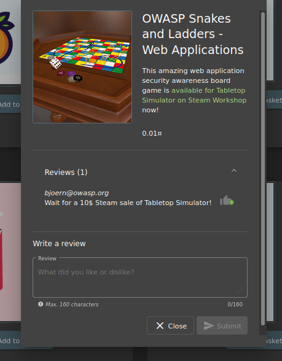
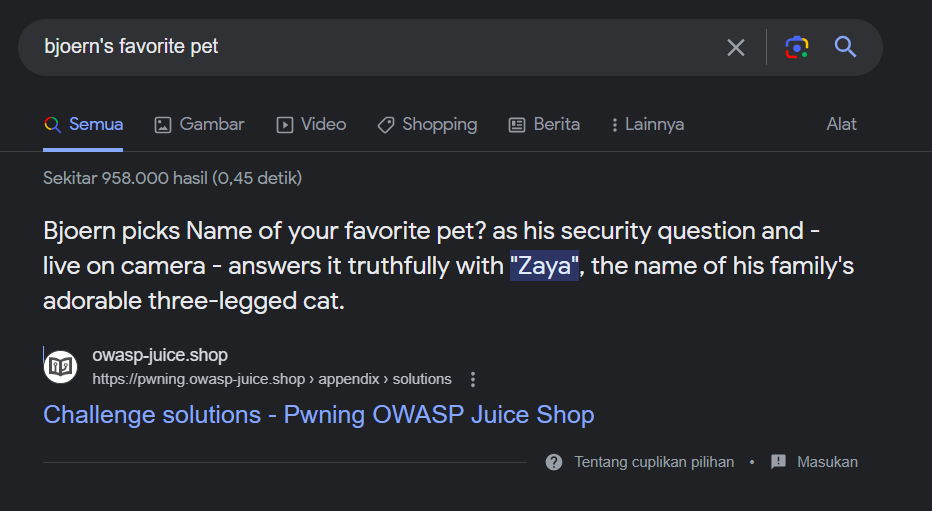
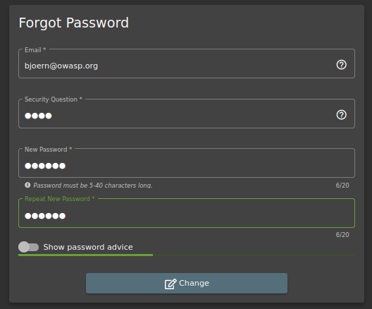

## Cover

<h3 align="center">
    <b>Praktikum Kemanan Jaringan</b> 
    A7 Identification and Authentication Failures (OWASP 10 Juice Shop)
</h3>
 

  

 

    Dosen Pembimbing: 
    Ferry Astika Saputra, S.T., M.Sc.

 

    Disusun Oleh: 
    Bima Aurasakti Rochmatullah (3122640046)

 

    <b>
        KELAS D4 LJ IT B  
        JURUSAN D4 LJ TEKNIK INFORMATIKA  
        DEPARTEMEN TEKNIK INFORMATIKA DAN KOMPUTER   
        POLITEKNIK ELEKTRONIKA NEGERI SURABAYA  
        2023
    </b>

 

## Laporan

Sebelumnya Identification and Authentication Failures dikenal sebagai Broken Authentication. Identifikasi dan autentikasi membantu framework digital sebagai pertahanan awal. Identifikasi melibatkan pengatribusian identitas unik setiap pengguna untuk menggunakan layanan aplikasi. Autentikasi memvalidasi sesi pengguna berdasarkan identitas yang ditetapkan dan kredensial akses. Kegagalan identifikasi dan autentikasi terjadi ketika aplikasi gagal menerapkan fungsi yang terkait dengan identitas pengguna, keaslian, dan manajemen sesi dengan benar. Kegagalan seperti ini sering menyebabkan ancaman tingkat sistem yang terus-menerus dieksploitasi oleh aktor jahat untuk mengambil identitas pengguna, pencurian data, atau kompromi seluruh sistem

---> [Video Demo](https://drive.google.com/drive/folders/1PE0PXa1lkr7EXYPnLLwehOOLdQ2jlo73?usp=share_link) <---

### A. Bjoern's Favorite Pet

Pada percobaan satu ini akan mereset password dari akun OWASP Bjoern via Forgot Password dengan menjawab pertanyaan keamanan yang diberikan oleh sistem.

1. Mencari akun dari user Bjoern pada review salah satu produk di Juice Shop website

    

2. Setelah alamat email Bjoern dicopy, pindah ke halaman login, dan klik Forgot your password pada login page karena tidak tahu apa password untuk akun ini

    

3. Inputkan email bjoern@owasp.org dan akan tampil pertanyaan keamanan dari akun tersebut yaitu nama hewan favorit nya.

    

4. Untuk bisa menemukan nama hewan favorit Bjoern, mencoba mencari di internet dengan keyword “Bjoern’s favorite pet” dan hasil teratasnya adalah sebagai berikut.

    

5. Setelah diketahui nama hewan favoritnya adalah Zaya, inputkan pada form lupa password. Ketikkan password baru sesuai keinginan dan klik change. Di sini saya menggunakan password baru: Bjoern

    

6. Setelah klik change, akan tampil notifikasi berhasil menyelesaikan challenge

    

7. Untuk membuktikan berhasil login atau tidak menggunakan password yang baru, Kembali ke halaman login dan masukkan email dan password yang baru

    
    
