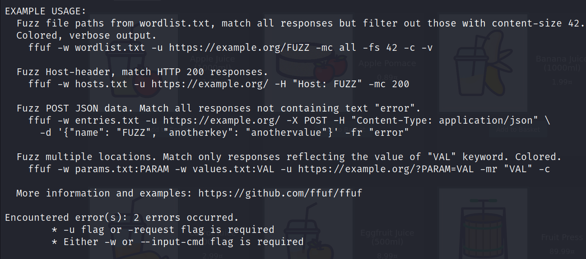
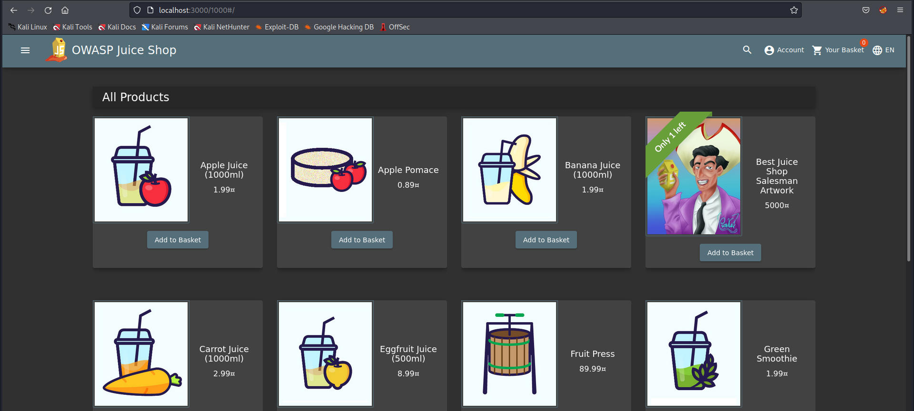
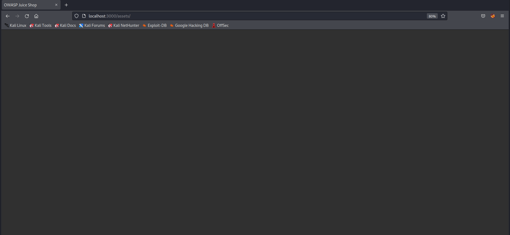
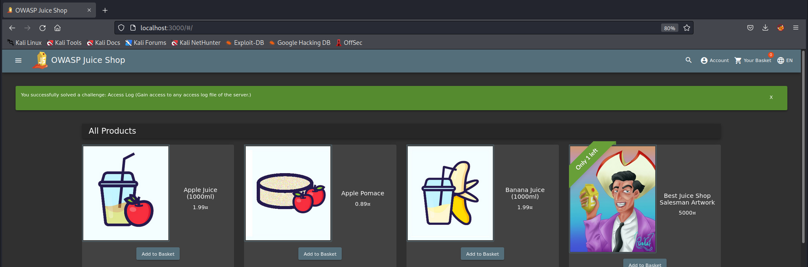

## Cover

<h3 align="center">
    <b>Praktikum Kemanan Jaringan</b> 
    A9 Security Logging and Monitoring Failures (OWASP 10 Juice Shop)
</h3>
 

  

 

    Dosen Pembimbing: 
    Ferry Astika Saputra, S.T., M.Sc.

 

    Disusun Oleh: 
    Bima Aurasakti Rochmatullah (3122640046)

 

    <b>
        KELAS D4 LJ IT B  
        JURUSAN D4 LJ TEKNIK INFORMATIKA  
        DEPARTEMEN TEKNIK INFORMATIKA DAN KOMPUTER   
        POLITEKNIK ELEKTRONIKA NEGERI SURABAYA  
        2023
    </b>

 

## Laporan

Berdasarkan OWASP Top 10 2021, kategori Security Logging and Monitoring Failures membantu dalam mendeteksi, mengeskalasi, dan menanggapi pelanggaran aktif. Tanpa pencatatan (logging) dan pemantauan (monitoring), pelanggaran tidak dapat dideteksi. Pencatatan deteksi harusnya dapat terjadi saat :
- Login berulang kali yang gagal
- Peringatan dan kesalahan akan menghasilkan pesan log yang tidak memadai
- Peringatan dan respons yang tidak ada

Berikut merupakan daftar klasifikasi CWE pada kategori A9 ini :

CWE-117 Improper Output Neutralization for Logs Memungkinkan penyerang memalsukan entri log atau konten berbahaya ke dalam log. Terjadi ketika :

a. Data memasuki aplikasi dari sumber yang tidak terpercaya

b. Data ditulis ke file log aplikasi atau sistem

- CWE-223 Omission of Security-relevant Information

    Aplikasi tidak merekam atau menampilkan informasi yang penting untuk mengidentifikasi sumber atau sifat serangan atau menentukan apakah suatu Tindakan tidak aman.

- CWE-532 Insertion of Sensitive Information into Log File

    a. Informasi yang ditulis ke file log dapat bersifat sensitive dan memberikan panduan berharga bagi penyerang atau mengekspos informasi pengguna yang sensitive

    b. Meskipun mencatat semua informasi mungkin berguna selama tahap pengembangan, penting agar tingkat pencatatan diatur dengan tepat sebelum produk dikirimkan sehingga data pengguna yang sensitive dan informasi sistem tidak terpapar ke penyerang.

- CWE-778 Insufficient Logging

    a. Perangkat tidak merekam peristiwa tersebut atau menghilangkan detail penting tentang peristiwa tersebut saat mencatatnya

    b. Peristiwa penting keamanan tidak dicatat dengan benar, seperti Upaya login yang gagal berkali-kali.

Dalam percobaan kali ini, kali mencoba 2 percobaan yaitu :

1. Mengakses access log file dari server (masuk ke dalam CWE-532 dikarenakan file penting dari server dapat diakses oleh penyerang)

2. Login dengan username yang benar dengan menggunakan password yang didapatkan dari file access log yang sudah tersebar. (masuk ke dalam CWE-778 dikarenakan percobaan login berulangkali dengan kesalahan username dan password tidak dihiraukan dan tetap bisa memasukkan username dan password yang lainnya).

---> [Video Demo](https://drive.google.com/drive/folders/1PE0PXa1lkr7EXYPnLLwehOOLdQ2jlo73?usp=share_link) <---

### A. Subjudul

Mengakses access log file dari server (masuk ke dalam CWE-532 dikarenakan file penting dari server dapat diakses oleh penyerang)

1. Persiapkan juice shop

    

2. Menggunakan FFUF

    

    FFUF merupakan alat untuk melakukan fuzzing pada aplikasi web. Fuzzing adalah proses pengujian perangkat lunak yang melibatkan pengiriman input yang tidak valid, acak, atau tidak terduga ke aplikasi target, dengan tujuan menemukan kelemahan atau kerentanan yang dapat dieksploitasi. FFUF dapat digunakan untuk fuzzing URl, parameter, wordlist generator, filter response, dan pemetaan aplikasi web. Berikut merupakan contoh perintah FFUF :

    

3. Menjalankan perintah FFUF untuk fuzzing URL

    

    Perintah tersebut digunakan untuk menjalankan URL dengan url tambahan yang diambilkan dari wordlist “usr/share/wordlists/dirb/common.txt”. Wordlist tersebut berisi daftar kata yang umum digunakan untuk menguji dan mencari direktori atau file yang ada pada server web. Wordlist umum ini biasanya mencakup beberapa nama file umum, direktori umum, atau jalur URL yang sering digunakan dalam aplikasi web. Dari hasil diatas didapatkan status 200 dan size nya 1987 semua. Disini saya akan mencoba menerapkan salah satu string diatas pada browser, seperti gambar dibawah ini :

    

    Pada gambar diatas , mencoba mengakses localhost:3000/1000 , dan ternyata untuk halaman yang ditampilkan adalah list product. Dikarenakan pada hasil sebelumnya status dan size nya sama, hal ini memungkinkan bahwa juice shop memang bisa menerima url lain namun diarahkan ke list product.

4. Menjalankan Fuzzing url dengan menambahkan perintah -fs

    

    dikarenakan pada hasil sebelumnya didapatkan size sama 1987 maka dilakukan perintah -fs 1987 untuk menampilkan yang selain size tersebut. Setelah didapatkan hasilnya, maka dapat dicoba pada browser sebagai berikut :

    

    Percobaan pertama /assets tidak didapatkan hasil apapun, selanjutnya mencoba url yang kedua yaitu /ftp dan didapatkan hasil berikut ini :

    

    Dari hasil diatas didapatkan beberapa file, salah satu file yang mungkin bisa mendapatkan informasi lebih detail jika dicari tau lebih dalam adalah file support. Sehingga langkah selanjutnya adalah mencari url yang mengandung /support dengan cara berikut ini :

    

    Pada hasil pertama didapatkan string “Logs”, dan jika dijalankan pada browser didapatkan tampilan berikut ini :

    
    

    File tersebut dapat didownload dan jika dillihat isinya seperti gambar diatas. File ini sangat penting dan bersifat rahasia karena memberikan informasi penting tentang aktivitas akses ke sistem. Jika kembali ke juice shop, sudah didapatkan alert berhasil menyelesaikan access log.

    
