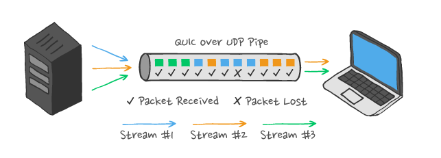
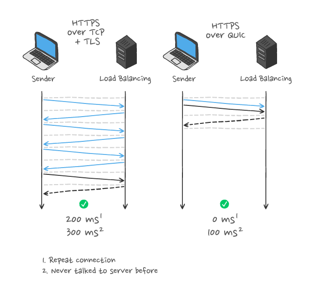

## Cover

<h3 align="center">
    <b>Praktikum Kemanan Jaringan</b> 
    HTTP Over UDP - HTTP/3 and QUIC
</h3>
 

  

 

    Dosen Pembimbing: 
    Ferry Astika Saputra, S.T., M.Sc.

 

    Disusun Oleh: 
    Bima Aurasakti Rochmatullah (3122640046)

 

    <b>
        KELAS D4 LJ IT B  
        JURUSAN D4 LJ TEKNIK INFORMATIKA  
        DEPARTEMEN TEKNIK INFORMATIKA DAN KOMPUTER   
        POLITEKNIK ELEKTRONIKA NEGERI SURABAYA  
        2023
    </b>

 

## Laporan

HTTP/3 dan Quic menjadi standar baru yang membuat penjelajahan web kalian lebih cepat dan lebih aman.

### Pengertian

HTTP/3 merupakan penulisan ulang protokol HTTP. HTTP/3 menggunakan protokol QUIC Google. HTTP/3 awalnya dikenal sebagai HTTP-over-QUIC. HTTP/3 juga menyertakan enkripsi TLS 1.3 sehingga tidak perlu HTTPS terpisah yang mengunci keamanan ke protokol seperti yang ada saat ini. **QUIC adalah** singkatan dari “Quick UDP Internet Connections.” Protokol ini dirancang untuk menjadi lebih cepat dengan latensi yang lebih rendah daripada TCP. QUIC menawarkan lebih sedikit overhead saat membuat koneksi dan transfer data lebih cepat melalui koneksi. Tidak seperti TCP, kesalahan seperti sepotong data yang hilang tidak akan menyebabkan koneksi berhenti dan menunggu masalah diperbaiki. QUIC akan terus mentransfer data lain saat masalah sedang diselesaikan. Faktanya, QUIC telah ditambahkan ke Google Chrome pada tahun 2013. Chrome menggunakannya ketika berkomunikasi dengan layanan Google dan beberapa situs web lain. seperti Facebook dan itu tersedia untuk aplikasi Android. Namun, QUIC bukan standar yang diintegrasikan ke dalam browser web lain. Dengan HTTP/3, teknologi ini juga hadir dengan cara standar ke peramban lain. HTTP/3 adalah protokol yang lebih baru, lebih baik, dan lebih cepat. Ini merupakan solusi yang lebih modern yang harus memberikan peningkatan keamanan dan kecepatan ke web.

### Keunggulan

1. **Tidak ada Head-of-Line Blocking**
    Head-of-line blocking adalah salah satu kelemahan HTTP/2 yang mana sudah tidak ada di HTTP/3. Pada poin ini, persaingan antara HTTP/2 vs HTTP/3 dimenangkan oleh HTTP/3. Physical connection bisa mengalirkan banyak resource. Namun apabila ada satu resource yang mengalami kegagalan, semua resource akan tertahan. Selanjutnya, sistem akan mentransmisikan ulang paket yang hilang. 
    
    

    QUIC pada HTTP/3 bisa mengatasi kondisi tersebut. Pada kasus tersebut, QUIC tetap bisa melakukan multipleks. Jadi, meskipun ada satu resource yang kehilangan paket selama transmisi data berlangsung, hanya resource itu saja yang terpengaruh. Nah, hal ini mengurangi latensi pada koneksi internet yang buruk.

2. **Setup Koneksi Lebih Cepat**

    HTTP/2 maupun 3 sama-sama menggunakan TLS untuk koneksi yang lebih aman.  Pada HTTP/2, TCP+TLS setidaknya membutuhkan 2 Round-trip times (RTT). Hal ini menambah latensi.

    

    Sedangkan QUIC mengoptimasi handshake mechanism-nya supaya pertukaran antarprotokol tidak berlebihan ketika dua peers yang saling mengenal menjalin komunikasi. Jadi, setup koneksi terenkripsi yang pertama adalah satu RTT. Ketika sesi berlanjut maka pengiriman data payload akan bersama paket pertama. Hal ini memungkinkan pengurangan keseluruhan latensi yang cukup signifikan dan konsisten.

3. **Transisi yang Lebih Baik Antarjaringan**

    QUIC tidak membutuhkan IP address sebagai sumber atau tujuan request. QUIC menggunakan ID koneksi yang unik supaya setiap paket sampai di tempat yang tepat. ID koneksi ini tetap sama saat kalian pindah jaringan di tengah-tengah koneksi. Hal ini memungkinkan transmisi data bisa tetap berlanjut meski pindah jaringan. Contohnya adalah saat kalian awalnya menggunakan jaringan WiFi kemudian beralih ke jaringan LTE (paket data seluler) untuk streaming. Dengan HTTP/3, proses streaming bisa tetap berlanjut secara lancar. Namun, tidak demikian dengan HTTP/2.

4. **Keamanan yang Lebih Baik**

    QUIC hampir seluruhnya terenkripsi. Hal ini menunjukan bahwa HTTP/3 memberikan peningkatan keamanan yang cukup signifikan. Dengan adanya enkripsi built-in, risiko mengalami serangan manipulator-in-the-middle (MitM) lebih kecil. Selain itu, QUIC juga memiliki sejumlah fitur untuk melindungi dari serangan DDoS.
    

Sumber: [jetorbit.com](https://www.jetorbit.com/blog/http-3-dan-quic-percepat-web-browsing/)