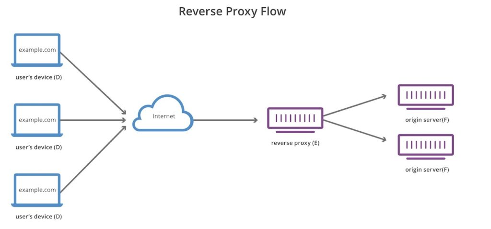

## Cover

<h3 align="center">
    <b>Praktikum Kemanan Jaringan</b> 
    Reverse Proxy dan Load Balancing
</h3>
 

  

 

    Dosen Pembimbing: 
    Ferry Astika Saputra, S.T., M.Sc.

 

    Disusun Oleh: 
    Bima Aurasakti Rochmatullah (3122640046)

 

    <b>
        KELAS D4 LJ IT B  
        JURUSAN D4 LJ TEKNIK INFORMATIKA  
        DEPARTEMEN TEKNIK INFORMATIKA DAN KOMPUTER   
        POLITEKNIK ELEKTRONIKA NEGERI SURABAYA  
        2023
    </b>

 

## **Reverse Proxy**

Reverse proxy pada jaman ini makin banyak digunakan, dipelajari dan dibahas di banyak forum, terutama forum-forum Sysadmin, Devops, hingga forum-forum yang membahas IT Infrastructure. Karena keunggulannya, metode reverse proxy ini juga banyak digunakan untuk melengkapi topologi aplikasi-aplikasi masa kini yang menggunakan micro services. Biasanya si proxy ini akan berlaku sebagai Load Balancer. Dia akan membagi beban ke masing-masing backend node.

### Pengertian

Reverse proxy ini merupakan sebuah fitur/modul di dalam sebuah webserver, yang berfungsi untuk melakukan port forwarding suatu request, dari public request menuju ke dalam sistem. Sebagai proxy, tentu juga memiliki kemampuan content caching, yaitu penyimpanan data sementara, agar saat terjadi request ulang, tidak perlu mengambil dari database. Dengan kemampuan-kemampuan tersebut, sebuah webserver akan mampu mengerjakan pekerjaan-pekerjaan dari sebagai sekedar proxy, hingga sebagai upstream proxy yang kadang banyak difungsikan sebagai pengganti NAT. Dengan kemampuannya pula, reverse proxy akan mampu dimanfaatkan untuk menghemat IP Address.

### Cara Kerja

Seperti yang sudah dijelaskan diatas, Reverse Proxy berada diantara client dan server. Fungsi utama Reverse Proxy adalah menerima dan meneruskan request dari client ke server atau sebaliknya. Cara kerja Reverse Proxy bisa digambarkan seperti contoh berikut, misalnya kamu bertindak sebagai client yang ingin mengakses suatu website. Request yang diberikan client sebelum sampai ke server akan diterima oleh reverse proxy terlebih dahulu. Setelah itu Reverse Proxy akan meneruskan ke server dan kemudian menerima balasan dari server yang nantinya akan disampaikan ke client.

Sumber:
    [blog.ecampuz.com](https://blog.ecampuz.com/reverse-proxy-solusi-berhemat-ip-publik-kampus/#:~:text=Lantas%2C%20apa%20sih%20reverse%20proxy,request%20menuju%20ke%20dalam%20sistem.),
    [domainesia.com](https://www.domainesia.com/berita/reverse-proxy/)

## **Load Balancing**

Secara sederhana, load balancing adalah sebuah solusi yang dapat Anda terapkan untuk menstabilkan server website Anda yang memiliki lonjakan traffic. Selain itu, penerapan load balancing juga dapat menghindari ganggu server down ketika traffic ke website Anda mengalami lonjakan.

### Pengertian

Load balancing merupakan proses pendistribusian traffic atau lalu lintas jaringan secara efisien ke dalam sekelompok server, atau yang lebih dikenal dengan server pool atau server farm. Load balancing ini berguna agar salah satu server dari website yang mendapatkan banyak lalu linta kunjungan tidak mengalami kelebihan beban.

Sebuah website yang populer biasanya akan mendapatkan lalu lintas kunjungan yang sangat amat banyak dalam satu waktu. Jika salah satu server mengalami kelebihan beban, proses loading dari website tersebut pasti akan lebih lambat dari biasanya, atau bahkan membuatnya tidak bisa diakses sama sekali. Maka dari itu, load balancing adalah hal yang perlu diterapkan.

### Cara Kerja

load balancer atau perangkat load balancing akan bekerja dengan cara mendistribusikan lalu lintas kunjungan ke dalam beberapa server demi memastikan tidak ada salah satu server yang mengalami kelebihan beban. Load balancer akan meminimalkan waktu respons server secara efektif.

Jika diibaratkan, load balancing memiliki fungsi yang sama seperti polisi lalu lintas yang memiliki tugas untuk mencegah kemacetan dan insiden lalu lintas lainnya. Dengan begitu, load balancer harus bekerja untuk memastikan arus lalu lintas jaringan tetap lancar dan dapat memberikan keamanan pada sistem kerja jaringan tersebut. Secara sederhana, Anda dapat menyederhanakan cara kerja load balancing sebagai berikut:

1. Pengguna meminta akses masuk ke server.
2. Load balancer menerima permintaan tersebut dan mendistribusikan lalu lintas tersebut ke beberapa server.
3. Jika salah satu server sudah hampir penuh, load balancer akan mengalihkan lalu lintas tersebut ke server lain yang masih tersedia.

### Jenis

#### **A. Hardware Load Balancer**

Hardware Load Balancer merupakan perangkat load balancing yang berbentuk perangkat keras atau fisik. Load balancer ini dapat mendistribusikan permintaan lalu lintas jaringan berdasarkan pengaturan yang diterapkan.

Load balancer ini harus diletakkan bersamaan dengan server di pusat data lokal karena bentuknya yang fisik. Jumlah load balancer yang dipasang dapat disesuaikan dengan jumlah lalu lintas tertinggi. Biasanya, load balancer ini dapat menangani lalu lintas dalam jumlah besar. Namun, Hardware Load Balancer memiliki harga yang cukup mahal.

#### **B. Software Load Balancer**

Berkat perkembangan perangkat digital, load balancer sudah memiliki versi non-fisiknya. Software Load Balancer termasuk ke dalam perangkat load balancing yang berbentuk perangkat lunak. Artinya, load balancer ini dapat dipasang secara digital pada server. Terdapat dua jenis Software Load Balancer, yaitu komersial dan open source.

Jika dibandingkan dengan Hardware Load Balancer, Software Load Balancer ini harganya relatif lebih murah. Selain itu, load balancer ini juga lebih fleksibel karena Anda dapat mengubah load balancer ini sesuai kebutuhan.

#### **C. Virtual Load Balancer**

Secara sederhana, Virtual Load Balancer adalah gabungan dari dua jenis perangkat load balancing sebelumnya. Load balancer ini mengombinasikan kedua jenis load balancer sebelumnya ke dalam mesin virtual. Anda akan mendapatkan Hardware Load Balancer yang dipasang sebagai perangkat lunak di dalam mesin virtual.

### Metode 

#### **1. Round Robin**

Metode load balancing yang paling umum dan sering digunakan yaitu Round Robin. Metode ini bekerja dengan cara menyalurkan lalu lintas jaringan secara berurutan dari satu server ke server lainnya sehingga menciptakan rotasi pembagian yang stabil.

Sebagai contoh, website Anda memiliki tiga server yaitu: A, B, dan C. Ketika ada permintaan lalu lintas yang masuk, permintaan tersebut akan masuk ke server A terlebih dahulu. Permintaan selanjutnya akan masuk ke server B, permintaan setelahnya akan masuk ke server C, dan prosesnya akan berulang terus.

#### **2. IP Hash**

IP Hash adalah metode load balancing yang melakukan pendistribusian lalu lintas jaringan berdasarkan data yang berhubungan dengan IP (incoming packet) dari pengguna. Sebagai contoh, data seperti IP destinasi, domain, URL, hingga port number akan menentukan server mana yang diarahkan oleh load balancer.

#### **3. Least Bandwidth**

Dalam metode Least Bandwidth, pendistribusian lalu lintas jaringan akan dilakukan berdasarkan server dengan jumlah jaringan paling kecil pada ukuran megabyte per second (Mbps) terlebih dahulu. Jadi, ketika ada permintaan masuk, lalu lintas jaringan tersebut akan dialihkan langsung ke server dengan ukuran Mbps paling kecil dibanding yang lain.

#### **4. Least Connection**

Metode Least Connection akan mendistribusikan lalu lintas jaringan berdasarkan server dengan jumlah koneksi yang paling sedikit terlebih dahulu. Jadi, jika salah satu server memiliki beban koneksi yang lebih besar, walaupun posisinya lebih di depan, permintaan lalu lintas jaringan akan dialihkan ke server dengan koneksi yang lebih kecil terlebih dahulu. Hal ini dapat mencegah terjadinya kelebihan beban pada salah satu server.

#### **5. Least Response Time**

Dapat dikatakan bahwa Least Response Time adalah versi upgrade dari metode Least Connection. Pada metode ini, distribusi lalu lintas jaringan dilakukan melalui dua cara, yaitu berdasarkan jumlah koneksi yang paling kecil dan waktu respons yang paling cepat. Jadi. ketika ada permintaan masuk, lalu lintas tersebut akan dialihkan ke server dengan koneksi paling kecil dan respons paling cepat terlebih dahulu dibandingkan server lainnya.

### Kelebihan

#### **1. Memaksimalkan Performa Server**

Menerapkan load balancing dapat memaksimalkan performa dari setiap server. Load balancer dapat mempercepat respons server hingga mencegah terjadinya berbagai macam masalah seperti kelebihan beban dan down. Selain itu, load balancer juga dapat membantu membuat jaringan lebih stabil ketika diakses.

#### **2. Menambah Fleksibilitas Server**

Fleksibilitas dari suatu server akan meningkat ketika administrator dapat mengelola lalu lintas yang masuk dengan lancar dan teratur. Load balancer dapat membantu memberikan beban yang merata dan seimbang setiap server agar permintaan lalu lintas dapat masuk dengan lancar dan teratur. 

#### **3. Memudahkan Proses Distribusi Lalu Lintas**

Load balancer dapat memudahkan proses distribusi lalu lintas, jadi kemungkinan terjadinya down akan makin kecil. Sebagai contoh, ketika salah satu server tidak dapat menerima permintaan lalu lintas, load balancer akan mengalihkan permintaan tersebut ke server lain yang tersedia dan memadai.

#### **4. Manajemen Kegagalan Server Lebih Efisien**

Penerapan load balancing dapat membantu Anda mengatasi kegagalan server secara lebih efisien. Load balancer dapat mendeteksi server yang gagal menerima permintaan, menghentikan lalu lintasnya, dan mengirimkannya kepada server yang lain. Dengan begitu, manajemen kegagalan server akan dapat dilakukan secara lebih efisien.

Sumber: [cloudmatika.co.id](https://cloudmatika.co.id/blog-detail/apa-itu-load-balancing)

## Perbedaan Reverse Proxy dan Load Balancing

“Setiap load balancer yang beroperasi pada lapisan tujuh (http) adalah reverse proxy, tetapi tidak setiap reverse proxy adalah load balancer. Bisa dibilang load balancer adalah jenis reverse proxy.” Load Balancers yang memproses pada lapisan empat atau di bawahnya juga dianggap sebagai reverse proxy tetapi mereka memiliki lebih sedikit fitur dan fungsi karena tidak mengurai paket seperti HTTP. Pekerjaan utama load balancer adalah menerima permintaan dan mendistribusikan lalu lintas ke sejumlah server. reverse proxy masih relevan hanya untuk satu server. Dalam sistem seperti itu, load balancer tidak diperlukan, tetapi reverse proxy menyediakan lapisan keamanan ekstra dalam kasus tersebut.