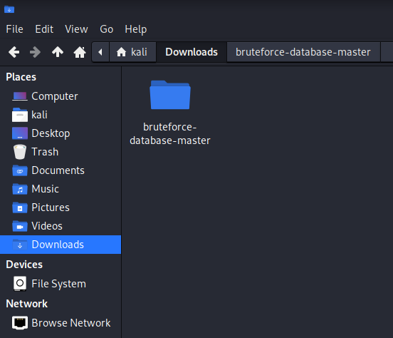

## Cover

<h3 align="center">
    <b>Praktikum Kemanan Jaringan</b><br>
    Attack Scenario
</h3>
<br>
<p align="center">
  
</p>
<br>
<p align="center">
    Dosen Pembimbing:<br>
    Ferry Astika Saputra, S.T., M.Sc.
</p>
<br>
<p align="center">
    Disusun Oleh:<br>
    Bima Aurasakti Rochmatullah (3122640046)
</p>
<br>
<p align="center">
    <b>
        KELAS D4 LJ IT B <br>
        JURUSAN D4 LJ TEKNIK INFORMATIKA <br>
        DEPARTEMEN TEKNIK INFORMATIKA DAN KOMPUTER <br> 
        POLITEKNIK ELEKTRONIKA NEGERI SURABAYA <br>
        2023
    </b>
</p>
<br>


## Laporan

Pada praktikum ini, kita mencoba melakukan peretasan pada sebuah Virtual Box Image dengan OS Ubuntu. Goal dari praktikum kali ini adalah kita berhasil mengakses database dan mendapatkan user rootnya. Untuk mengakses database kita akan menggunakan SQLmap dan untuk mendapatkan user root, kita menggunakan Hydra.

**SQLmap** merupakan alat (tool) bantu open source dalam melakukan tes penetrasi yang mengotomasi proses deteksi dan eksploitasi kelemahan SQL injection dan pengambil-alihan server basis data. SQLmap dilengkapi dengan pendeteksi canggih, fitur-fitur handal bagi penetration tester, beragam cara untuk mendeteksi basis data, hingga mengakses file system dan mengeksekusi perintah dalam sistem operasi melalui koneksi out-of-band [[1](https://github.com/sqlmapproject/sqlmap/blob/master/doc/translations/README-id-ID.md)].

**Hydra** merupakan salah satu tool cracking password yang sangat populer di kalangan pentester, hal ini karena hydra mampu melakukan cracking password dengan cukup cepat dan juga mendukung banyak protokol. Tool ini merupakan tool yang didesain khusus untuk melakukan cracking password dengan metode brute force [[2](https://www.tutorialjaringan.com/2019/07/tutorial-cara-cracking-password-router-dengan-hydra.html)].

**Brute force** adalah upaya mendapatkan akses sebuah akun dengan menebak username dan password yang digunakan. Brute force attack sebenarnya merupakan teknik lama dalam aksi cyber crime. Namun, ternyata masih banyak digunakan karena dianggap masih efektif. Namun itu hanya langkah awal metode serangan. Tujuan utama brute force adalah mengakses situs, server yang menyimpan berbagai informasi dan aset penting lain. Setelah masuk ke dalam sistem, hacker dapat mengendalikan website Anda hingga mencuri data. [[3](https://www.niagahoster.co.id/blog/brute-force-adalah/)].

### A. Mendapatkan User Root

1. Langkah pertama, kita lihat inet kita menggunakan ifconfig

    ```$ ifconfig```

    

2. Langkah selanjutnya kita jalankan command berikut dan masukkan inet yang berhasil kita dapatkan pada langkah pertama

    ```$ ipcalc 192.168.125.161```

    

3. Langkah selanjutnya kita lakukan scanning network dengan menggunakan NMap untuk mendapatkan ip target yang akan kita serang dengan menggunakan ip network yang kita dapatkan dari menjalankan command ipcalc

    ```$ nmap 192.168.125.0/24 -p 22 --open```

    

4. Setelah kita mendapatkan ip yang akan kita serang. Selanjutnya kita download zip atau clone [repo berikut](https://github.com/duyet/bruteforce-database) untuk mendapatkan list username dan password yang akan kita gunakan untuk bruteforce

    

5. Setelah kita copypaste file username.txt dan 2151220-passwords.txt ke dalam folder /home/kali pada case saya

    
    

6. Selanjutnya kita jalankan command Hydra untuk memulai proses bruteforcenya dengan menggunakan ip target yang sudah kita dapatkan sebelumnya pada langkah ke-3

    ```$ hydra -L usernames.txt -P 2151220-passwords.txt ssh://192.168.125.148```

    
    

    sayangnya pada step ini, proses bruteforce menggunakan Hydra belum mendapatkan hasil dengan proses sudah berjalan selama 13 jam 31 menit

### B. Mengakses Database

1. Langkah pertama yang saya lakukan untuk mendapatkan akses database adalah melakukan crawling untuk mendapatkan sitemap website yang akan kita serang menggunakan skipfish

    ```$ skipfish -o 202 http://192.168.6.148```
    
    

    Tampilan ini menunjukkan program skipfish sedang berjalan dan sedang melakukan crawling

    

    Berikut adalah tampilan setelah proses skipfish selesai berjalan

    

    Berikut ini adalah hasil crawl yang berhasil dilakukan oleh skipfish

2. Setelah berhasil mendapatkan sitemapnya kita dapat melihat URL yang memiliki input parameter penting yaitu /?tampil=artikel_detail&id=78 Selanjutnya kita jalankan sqlmap untuk mendapatkan list database yang ada pada server menggunakan command berikut

    ```$ sqlmap -u "http://192.168.30.148?id=1" --dbs```

    

    setelah menjalankan perintah diatas, kita mendapatkan list database yang ada pada server ini