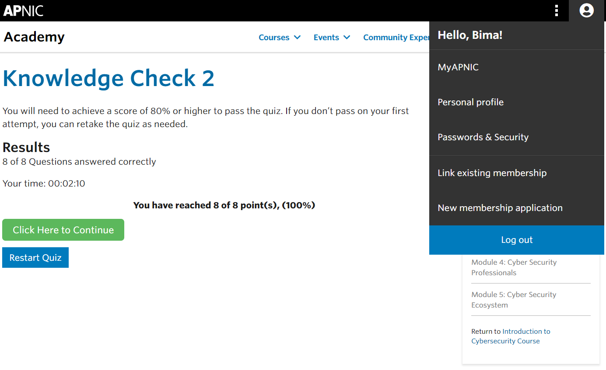

## Cover

<h3 align="center">
    <b>Kemanan Jaringan</b> 
    Cyber Security In The Organization
</h3>
 

  

 

    Dosen Pembimbing: 
    Ferry Astika Saputra, S.T., M.Sc.

 

    Disusun Oleh: 
    Bima Aurasakti Rochmatullah (3122640046)

 

    <b>
        KELAS D4 LJ IT B  
        JURUSAN D4 LJ TEKNIK INFORMATIKA  
        DEPARTEMEN TEKNIK INFORMATIKA DAN KOMPUTER   
        POLITEKNIK ELEKTRONIKA NEGERI SURABAYA  
        2023
    </b>

 

## Laporan

Pada modul 2 ini membahas tentang Cyber Security pada organisasi. Mengapa sebuah organisasi membutuhkan keamanan? Alasan utamanya adalah karena jika terdapatn ancaman terhadap organisasi, maka akan sangat merugikan persahaan. 

Sebelum kita mengidentifikasi resiko keamanan, alangkah baiknya jika kita memahami dampaknya terlebih dahulu terhadap organisasi yaitu:

1. Operasi bisnis dapat terganggu dikarenakan terjadinya kerusakan infrastruktur.
2. Biaya operasi bisnis meningkat
3. Tidak dapat memberikan pelayanan sesuai kontrak
4. Citra organisasi terpengaruh

Untuk menghindari dampak-dampak yang ada tersebut, dibutuhkan suatu usaha untuk mengidentifikasi dan mengelola resiko yang dapat mengganggu aktifitas organisasi. Usaha pertama adalah melakukan mitigasi atau mengurangi dampak resiko dengan cara pengembangan security control. Usaha selanjutnya adalah transfer resiko yang ada agar dapat di handle oleh organisasi lain seperti asuransi.

Bagaimana cara meningkatkan kesiapsiagaan keaamanan cyber? berikut ini adalah cara-cara yang dapat dilakukan:

1. Menyadari tingkat dan kemungkinan risiko organisasi agar lebih proaktif dan siap.
2. Pendekatan komprehensif untuk manajemen risiko harus melibatkan orang-orang di seluruh organisasi untuk meningkatkan kualitas pengambilan keputusan untuk mengelola risiko.
3. Biasanya, manajemen puncak organisasi bertanggung jawab untuk memastikan keamanan organisasi.
4. Upaya ini akan membutuhkan organisasi untuk menginvestasikan sumber daya (uang, waktu dan personel) dan mengembangkan program keamanan cyber yang komprehensif.

Ancaman keamanan umum terhadap organisasi:

1. Denial of Service Attack

    Pada dasarnya, serangan DoS dilakukan melalui jaringan tekniknya adalah dengan mengirimkan banyak paket jaringan, lebih dari apa yang dapat dilakukan oleh server atau peralatan jaringan. Organisasi yang memiliki layanan yang terhubung ke Internet seperti situs web, DNS dan server email, rentan terhadap serangan ini.

2. Malicious Software (Malware)

    Beberapa contoh payload :

    - Virus
    - Worms
    - Rootkits
    - Backdoors
    - Trojans

    Pengguna komputer ditipu untuk mengeksekusi malware. Atau, pembuat malware mengeksploitasi kerentanan perangkat lunak yang ada. Setelah dieksekusi pada sistem, ia akan menjalankan payloadnya.

    Yang dilakukan oleh payload adalah:

    - Merekam apa yang diketik pengguna
    - Mengirim informasi (yaitu file atau isi database)
    - Mengenkripsi file lokal dan menuntut uang untuk membuka enkripsi mereka

3. Identity Theft

    Akses ke sistem biasanya ditentukan berdasarkan identitas atau kredensial seperti nama pengguna & kata sandi. Pencurian Identitas terjadi ketika penyerang mencuri identitas pengguna sehingga mereka dapat menyamar sebagai pengguna dan mendapatkan akses ke sistem.

4. Web Defacement

    Organisasi memiliki situs web untuk menyediakan informasi dan layanan kepada pelanggan mereka.
    Pengrusakan web terjadi ketika konten situs web dimodifikasi oleh penyerang. Ini dapat terjadi karena kerentanan dalam perangkat lunak server web atau sistem manajemen konten. Hal ini dapat menyebabkan tidak tersedianya layanan atau dapat mempengaruhi reputasi organisasi.

Cara Mengurangi Risiko Serangan Cyber:
Dikatakan bahwa dalam keamanan, satu solusi tunggal yang akan mencegah atau membuat masalah keamanan hilang. Untuk menghadapi risiko yang disebutkan sebelumnya, kita harus menerapkan kontrol di berbagai tingkatan.

1. Kontrol teknis untuk mendeteksi & mencegah

    (Misalnya firewall, filter spam, sistem deteksi intrusi, dan perangkat lunak antivirus)

2. Pendidikan dan pelatihan karyawan

    Terutama ketika berhadapan dengan phishing dan bagaimana mengembangkannya aplikasi web dengan aman

3. Memastikan bahwa penyedia jaringan memiliki kemampuan untuk dukung kami saat kami diserang

## Screenshot

 
 
 

