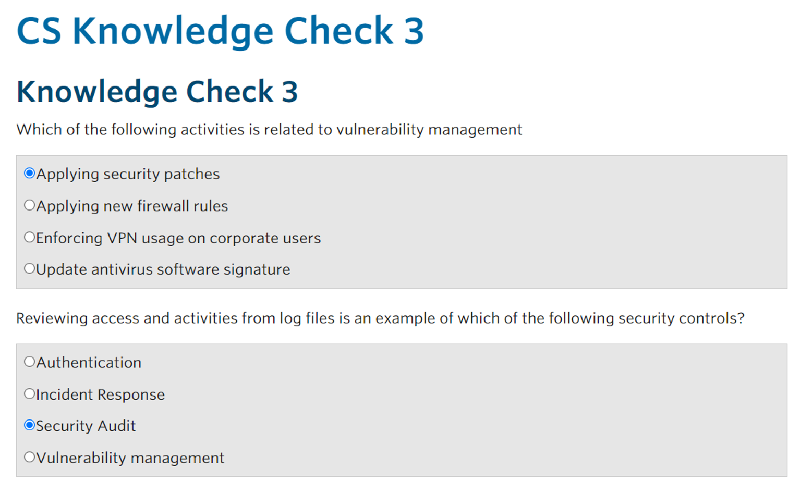
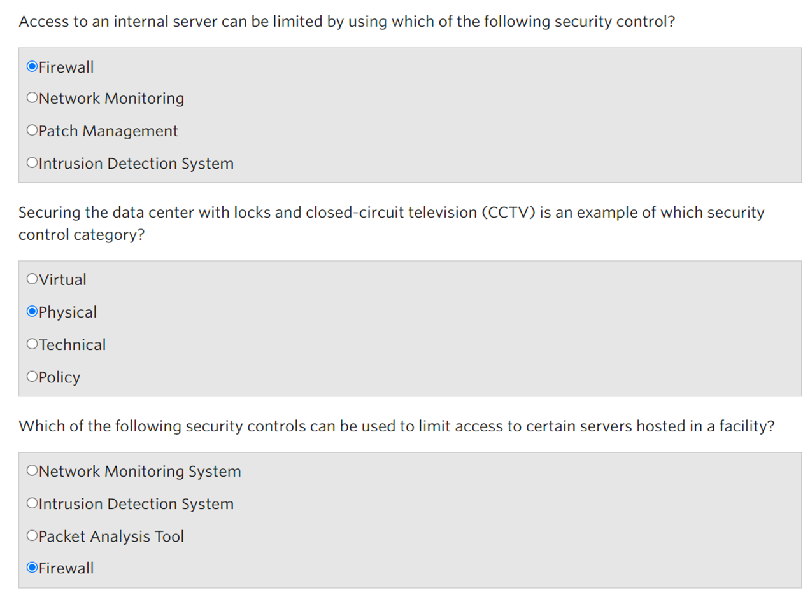
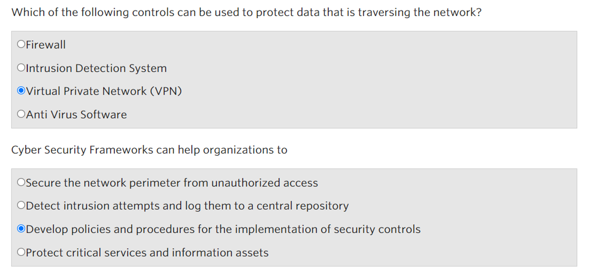

## Cover

<h3 align="center">
    <b>Keamanan Jaringan</b> 
    Cyber Security Controls
</h3>
 

  

 

    Dosen Pembimbing: 
    Ferry Astika Saputra, S.T., M.Sc.

 

    Disusun Oleh: 
    Bima Aurasakti Rochmatullah (3122640046)

 

    <b>
        KELAS D4 LJ IT B  
        JURUSAN D4 LJ TEKNIK INFORMATIKA  
        DEPARTEMEN TEKNIK INFORMATIKA DAN KOMPUTER   
        POLITEKNIK ELEKTRONIKA NEGERI SURABAYA  
        2023
    </b>

 

## Laporan

Pada modul 3 ini membahas tentang Cyber Security Control. Pada modul ini kita akan memahami bahwa keamanan jaringan membutuhkan penerapan yang sesuai pada lapisan yang berbeda, memahami berbagai jenis keamanan dan relevansinya untuk meningkatkan kesiapsiagaan, dan menghargai berbagai jenis pengetahuan atau keterampilan yang diperlukan untuk mengelola kontrol keamanan. 

### Countermeasures (Penanggulangan)

dalam keamanan, countermeasures atau yang dapat disebut sebagai pengamanan, kontrol kemanan, atau simply control. Countermeasures bertujuan untuk memanajemen resiko yang termasuk:

1. Policies and procedures
2. GUidelines
3. Practices or organizational structures

### Countermeasures (Penanggulangan)

Framework atau standar keamanan adalah serangkaian dokumentasi proses yang digunakan untuk mendefinisikan kebijakan dan prosedur seputar implementasi dan manajemen berkelanjutan dari kontrol keamanan di lingkungan perusahaan. Beberapa kerangka/standar keamanan siber yang populer diantaranya adalah

1. ISO 27000 Series (Information Security Management System)
2. NIST Cyber Security Framework
3. Payment Card Industry Data Security Standard (PCI DSS)
4. CIS Critical Security Controls

### Security Policies (Penanggulangan)

Kebijakan keamanan pada dasarnya menggambarkan apa yang harus dilakukan untuk melindungi organisasi dan aset informasinya. Mereka biasanya dalam bentuk dokumen yang ditulis dengan baik yang mencakup bidang-bidang utama seperti:

1. Backup Policies
2. IT Asset Usage Policies
3. Password Policies
4. Internet Policies

Sangat penting bahwa kebijakan keamanan dibagikan kepada setiap pemangku kepentingan sehingga mereka menyadari tanggung jawab dan harapan organisasi.

### Firewalls

Firewall mencegah akses tidak sah ke komputer atau jaringan. Mereka biasanya dipasang pada batas antara dua jaringan. Mereka dapat berupa perangkat keras atau perangkat lunak yang berjalan pada komputer yang bertindak sebagai gateway. 

**Apa itu Host-Based Firewall?**

Ini adalah perangkat lunak yang berjalan pada perangkat end user yang hanya melindungi komputer user tersebut.

**Apa yang bisa dilakukan Firewall?**

- Periksa lalu lintas berdasarkan kebijakan dan kemudian memblokir atau mengizinkannya. Ini juga berguna untuk membatasi akses ke sistem atau layanan tertentu.
- Filter lalu lintas berdasarkan sumber dan tujuan alamat atau nomor port, jenis jaringan lalu lintas atau atribut paket jaringan.

### Anti-Malware

Perangkat lunak anti-malware dapat melindungi kita dari virus dan ancaman malware lainnya termasuk trojan, ransomware, worm, dan spyware. Karena malware cenderung berkembang dengan cepat, penting untuk dipastikan bahwa solusi anti-malware memiliki informasi yang terbaru agar proses deteksi menjadi lebih efektif.

### Vulnerability Management (Manajemen Kerentanan)

Manajemen kerentanan adalah praktik siklus yang bertujuan untuk mengidentifikasi, mengklasifikasikan, memulihkan, dan mengurangi kerentanan. Hal ini penting karena terkadang, kerentanan ditemukan dalam perangkat lunak atau firmware yang memungkinkan musuh untuk mendapatkan akses tidak sah ke jaringan atau data. Menerapkan patches atau update secara tepat waktu adalah contoh hasil dari proses ini.

### Intrusion Detection System

Intrusion Detection System (IDS) adalah device atau perangkat lunak yang memantau jaringan dan sistem terhadap malicious activity. IDS melakukan scan terhatap:

1. Menyelidiki isi paket dan cari atribut yang terkait dengan aktivitas berbahaya atau pelanggaran kebijakan. Kegiatan ini kemudian dicatat dan akan diberitahukan kepada administrator sehingga tindakan lebih lanjut dapat diambil.
2. Dapat berbasis jaringan atau host.
3. Beroperasi sebagai pendeteksi atau sebagai Sistem Pencegahan Intrusi (IPS) untuk memblokir atau menghentikan aktivitas jahat.

### Encryption

Solusi enkripsi mengamankan data Anda dengan mengenkripsi sistem file, jaringan transaksi, media yang dapat dipindahkan, dan email. Data dan informasi yang dienkripsi hanya dapat diakses dengan kunci yang tepat atau kata sandi. Sebagai penangulangan, sangat penting sebuah perlindungan informasi rahasia untuk mengurangi dampak dari kebocoran atau pencurian data. Dalam organisasi, enkripsi banyak digunakan dalam protokol jaringan (SSH, HTTPS, VPN), dan email (PGP/SMIME).

### Two-Factor Authentication (2FA)

Otentikasi Dua Faktor adalah metode untuk mengonfirmasi identitas yang diklaim pengguna dengan memanfaatkan kombinasi dari dua komponen yang berbeda. 2FA secara signifikan mengurangi risiko penyerang mengakses akun online dengan menggabungkan kata sandi (sesuatu yang Anda ketahui) dengan faktor kedua, seperti ponsel atau token perangkat keras (sesuatu yang Anda miliki). Karena meningkatnya jumlah pelanggaran yang disebabkan oleh kata sandi yang lemah atau dicuri, banyak organisasi menerapkan 2FA ke semua sistem mereka.

**Bagaimana cara kerjanya?**

1. Login menggunakan username atau password seperti login biasanya
2. Pilih cara mendapatkan kode verifikasi
3. Masukkan 2FA kode yang anda dapatkan 

### Security Audit

Security Audit adalah penilaian teknis yang terukur dari suatu sistem atau aplikasi. Penilaian dapat melalui wawancara, security vulnerability scans, dan menganalisa akses fisik ke sistem.

### Tanggapan dan Penanganan Insiden

Bersiap untuk menanggapi dan menangani insiden keamanan adalah penting dalam meminimalkan dampak pelanggaran atau serangan keamanan dan pemulihan dengan cepat. Memiliki kemampuan ini berarti ada prosedur untuk:

1. Mendeteksi berbagai jenis insiden keamanan
2. Hapus akar penyebab insiden
3. Pulihkan ke keadaan pra-insiden
4. Tinjau pelajaran yang dipetik dari insiden tersebut untuk perbaikan di masa mendatang

Beberapa organisasi memiliki tim respons keamanan khusus (CERT/CSIRT) yang memiliki keterampilan dalam melakukan analisis log, investigasi malware, dan digital forensik. CSIRT terkadang juga berfungsi dengan entitas eksternal seperti lembaga penegak hukum, operator jaringan atau CERT pemerintah.

### Pendidikan dan Pelatihan

Memiliki budaya keamanan yang kuat sangat penting dalam melindungi organisasi. Keamanan tidak dapat dicapai tanpa dukungan semua pihak pemangku kepentingan dalam organisasi. Staf juga perlu menyadari pentingnya keamanan, kebijakan, tindakan pencegahan, peran dan tanggung jawabnya. Semua Ini dapat dicapai melalui kampanye kesadaran keamanandan, pelatihan dan destop exercise.

## Screenshot

 
 
 

