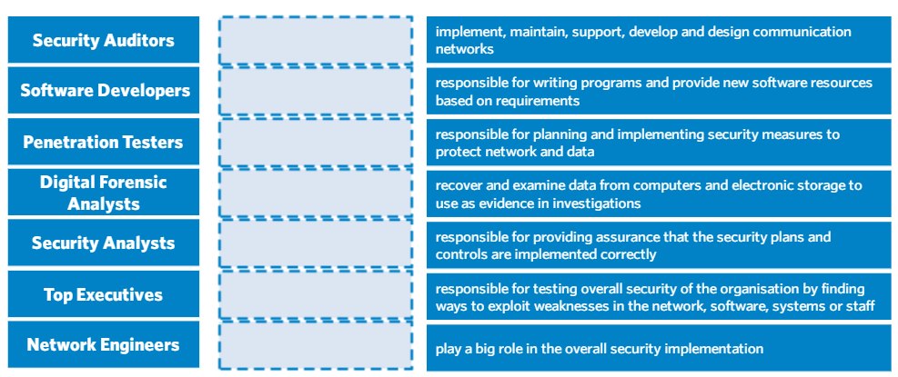

## Cover

<h3 align="center">
    <b>Keamanan Jaringan</b> 
    Essay Profesi
</h3>
 

  

 

    Dosen Pembimbing: 
    Ferry Astika Saputra, S.T., M.Sc.

 

    Disusun Oleh: 
    Bima Aurasakti Rochmatullah (3122640046)

 

    <b>
        KELAS D4 LJ IT B  
        JURUSAN D4 LJ TEKNIK INFORMATIKA  
        DEPARTEMEN TEKNIK INFORMATIKA DAN KOMPUTER   
        POLITEKNIK ELEKTRONIKA NEGERI SURABAYA  
        2023
    </b>

 

## Tugas

Dari list role yang ada diatas, ketika kerja nanti role apa yang ingin anda isi dan pada role tersebut anda ingin menjadi apa?

pada role diatas, untuk saat ini saya profesi yang cocok untuk saya adalah sebagai Software Developer. Pada role ini saya ingin menjadi Fullstack Developer. Fullstack Developer ini dalam artian jika ada job yang memang hanya membutuhkan Frontend Developer saya akan ambil, ataupun jika hanya Backend Developer. Alasan saya memilih role Software Developer sebagai Fullstack Developer dikarenakan untuk saat ini kemampuan yang saya kuasai masih seputar Software Developer saja. Tetapi saya tetap tertarik untuk mengetahui lebih banyak lagi role-role IT yang ada pada perusahaan, supaya saya dapat mengetahui dan memahami semua proses bisnis yang ada pada perusahaan IT. Hal tersebut saya lakukan supaya suatu saat saya dapat mengimplementasikan pada perusahaan saya sendiri.