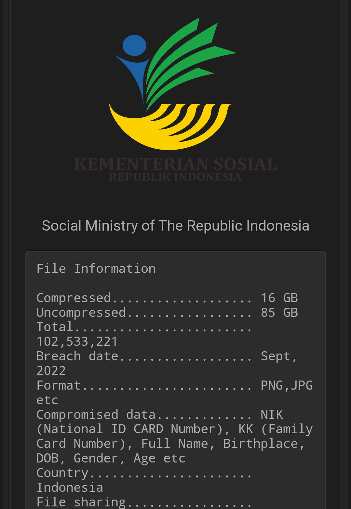

## Cover

<h3 align="center">
    <b>Keamanan Jaringan</b> 
    Essay Cyber Security
</h3>
 

  

 

    Dosen Pembimbing: 
    Ferry Astika Saputra, S.T., M.Sc.

 

    Disusun Oleh: 
    Bima Aurasakti Rochmatullah (3122640046)

 

    <b>
        KELAS D4 LJ IT B  
        JURUSAN D4 LJ TEKNIK INFORMATIKA  
        DEPARTEMEN TEKNIK INFORMATIKA DAN KOMPUTER   
        POLITEKNIK ELEKTRONIKA NEGERI SURABAYA  
        2023
    </b>

 

## Tugas

### **IT Sebagai Bisnis Support**

Awalnya, IT hanya digunakan sebagai alat manajemen dan pengolah data saja. Namun, seiring berjalannya waktu, perusahaan menyadari potensi bisnis yang dapat diciptakan oleh teknologi dan meningkatkan investasi mereka di bidang IT untuk mempercepat proses bisnis, meningkatkan efisiensi, serta meningkatkan kualitas produk dan layanan yang ditawarkan. Karena semakin banyak perusahaan mengandalkan teknologi untuk mengakselerasi bisnis mereka, IT tidak hanya sebagai pendukung tetapi juga merupakan bagian penting dari strategi bisnis perusahaan. IT membantu organisasi membuat keputusan bisnis yang lebih tepat waktu dan akurat, mempercepat inovasi produk dan layanan, serta meningkatkan keamanan informasi perusahaan. Oleh karena itu, di era digital saat ini, peran IT dalam mendukung bisnis dinilai sangat penting. IT bukan hanya alat manajemen, tetapi merupakan faktor penting yang menentukan keberhasilan atau kegagalan suatu perusahaan.

### **Sektor Bidang IT**

Dalam bidang IT terdapat dua sektor yaitu sektor vital dan sektor strategis.

**Sektor vital** adalah sektor yang ketika terjadi gangguan atau kegagalan, dapat berdampak signifikan terhadap kelangsungan hidup dan bisnis. Contoh sektor IT yang vital adalah sistem perbankan, sistem perawatan kesehatan, sistem transportasi, dan sistem energi. Gangguan atau kegagalan sistem ini dapat menyebabkan ketidakstabilan ekonomi, krisis kesehatan, dan efek buruk lainnya pada kehidupan masyarakat. Contoh sektor vital adalah:

1. Sistem perbankan: Dapat menyebabkan hilangnya data nasabah, kegagalan transaksi, dan hilangnya dana.
2. Sistem kesehatan: Dapat menyebabkan gangguan layanan kesehatan yang sangat dibutuhkan oleh masyarakat.
3. Sistem transportasi: Dapat menyebabkan gangguan mobilitas masyarakat, seperti keterlambatan transportasi umum, kecelakaan lalu lintas, dan kerugian ekonomi.
4. Sistem energi: Dapat menyebabkan pemadaman listrik dan kegagalan infrastruktur energi.

**Sektor strategis** adalah sektor yang dianggap sangat penting bagi kemajuan ekonomi dan keamanan nasional. Contoh sektor IT strategis termasuk mengembangkan teknologi masa depan seperti teknologi pertahanan, keamanan siber, AI, data besar, dan teknologi blockchain. Sektor strategis ini biasanya dilindungi dan didukung oleh pemerintah serta diberikan anggaran yang cukup untuk pengembangan dan pengamanannya.

1. Teknologi pertahanan: Pengembangan teknologi pertahanan yang kuat dapat membantu melindungi negara dari ancaman luar yang mungkin datang dari negara lain.
2. Keamanan siber: Pengembangan keamanan siber yang kuat dapat membantu melindungi sistem dan data penting dari serangan siber yang dapat mengancam keamanan nasional.
3. Pengembangan teknologi masa depan: Pengembangan teknologi seperti AI, big data, dan teknologi blockchain dapat membantu meningkatkan efisiensi bisnis dan pelayanan publik, serta meningkatkan daya saing negara dalam hal inovasi dan teknologi.
4. Sistem komunikasi: Sistem komunikasi yang kuat dan aman sangat penting untuk keberlangsungan bisnis dan keamanan nasional, serta berperan penting dalam hal berkomunikasi dan bertukar informasi secara efektif.

### **Convergence of ITC**

Convergence of ITC (Information Technology and Communication) adalah proses integrasi teknologi informasi dan komunikasi untuk menciptakan solusi baru yang lebih efisien dan inovatif. Convergence of ITC mengintegrasikan dan melengkapi berbagai teknologi seperti telepon, komputer, internet, televisi dan media lainnya untuk meningkatkan komunikasi, akses informasi dan produktivitas. Convergence of ITC menggabungkan teknologi komunikasi tradisional seperti telepon dan televisi dengan teknologi informasi seperti komputer dan internet untuk menciptakan solusi yang lebih efisien dan inovatif. Misalnya, layanan Voice over Internet Protocol (VoIP) menggunakan teknologi Internet untuk mengirimkan suara melalui jaringan data, menggantikan infrastruktur telepon tradisional. Selain itu, Convergence of ITC memungkinkan pengguna untuk mengakses berbagai layanan dan konten melalui perangkat yang sama seperti smartphone atau tablet. Convergence of ITC juga berdampak pada banyak aspek kehidupan, termasuk bisnis, pemerintahan, pendidikan, kesehatan, dan hiburan. Dalam bisnis, Convergence of ITC memungkinkan perusahaan untuk berkomunikasi dengan karyawan dan pelanggan mereka dengan cara yang lebih efisien dan terintegrasi. Di pemerintahan, Convergence of ITC akan memungkinkan pemerintah memberikan layanan publik secara online, memfasilitasi partisipasi warga, dan meningkatkan efisiensi administrasi. Secara keseluruhan, Convergence of ITC merupakan fenomena kunci dalam perkembangan teknologi modern karena mengintegrasikan berbagai teknologi menjadi solusi yang lebih efektif dan efisien.

### **Badan Siber dan Sandi Negara (BSSN)**

Badan Siber dan Sandi Negara (BSSN) merupakan instansi pemerintah Republik Indonesia yang bergerak di bidang Keamanan Informasi dan Keamanan Siber. BSSN dipimpin oleh Kepala Badan yang bertanggung jawab langsung kepada Presiden Republik Indonesia. BSSN mempunyai tugas melaksanakan keamanan siber secara efektif dan efisien dengan memanfaatkan, mengembangkan, dan mengonsolidasikan semua unsur yang terkait dengan keamanan siber. BSSN terdiri atas:
1. **Kepala**, mempunyai tugas memimpin dan bertanggung jawab atas pelaksanaan tugas dan fungsi BSSN.
2. **Wakil Kepala**, Wakil Kepala mempunyai tugas membantu Kepala dalam memimpin pelaksanaan tugas dan fungsi BSSN.
3. **Sekretariat Utama**, Sekretariat Utama mempunyai tugas         menyelenggarakan koordinasi pelaksanaan tugas, pembinaan, dan pemberian dukungan administrasi kepada seluruh unsur organisasi di lingkungan BSSN.
4. **Deputi Bidang Strategi dan Kebijakan Keamanan Siber dan Sandi**, mempunyai tugas menyelenggarakan perllmusan kebijakan teknis di bidang sistem dan strategi keamanan siber dan sandi.
5. **Deputi Bidang Operasi Keamanan Siber dan Sandi**, mempunyai tugas menyelenggarakan perumusan dan pelaksanaan kebijakan teknis di bidang operasi keamanan siber dan sandi.
6. **Deputi Bidang Keamanan Siber dan Sandi Pemerintahan dan Pembangunan Manusia**, mempunyai tugas menyelenggarakan perumusan dan pelaksanaan kebijakan teknis di bidang peningkatan kapasitas keamanan siber dan sandi pada sektor pemerintahan dan pembangunan manusia.
7. **Deputi Bidang Keamanan Siber dan Sandi Perekonomian**,  mempunyai tugas menyelenggarakan perumusan dan pelaksanaan kebijakan teknis di bidang peningkatan kapasitas keamanan siber dan sandi pada
sektor perekonomian.

### **Kementerian Komunikasi dan Informatika (Kemenkominfo atau Kominfo)**

Kementerian Komunikasi dan Informatika (Kemenkominfo atau Kominfo) adalah kementerian Indonesia yang mengurusi bidang komunikasi dan informatika. Merujuk pada Peraturan Presiden Nomor 22 Tahun 2023, Kementerian Komunikasi dan Informatika mempunyai tugas menyelenggarakan urusan pemerintahan di bidang komunikasi dan informatika untuk membantu Presiden dalam menyelenggarakan pemerintahan negara. Dalam melaksanakan tugas tersebut, Kementerian Komunikasi dan Informatika menyelenggarakan fungsi:
1. Perumusan, penetapan, dan pelaksanaan kebijakan di bidang pengelolaan sumber daya dan perangkat pos dan informatika, penyelenggaraan pos dan informatika, penatakelolaan aplikasi informatika, pengelolaan informasi dan komunikasi publik.
2. Koordinasi pelaksanaan tugas, pembinaan, dan pemberian dukungan administrasi kepada seluruh unsur organisasi di lingkungan Kementerian Komunikasi dan Informatika.
3. Koordinasi pelaksanaan tugas, pembinaan, dan pemberian dukungan administrasi kepada seluruh unsur organisasi di lingkungan Kementerian Komunikasi dan Informatika.
4. Pengawasan atas pelaksanaan tugas di lingkungan Kementerian Komunikasi dan Informatika.
5. Pelaksanaan bimbingan teknis dan supervisi atas pelaksanaan pengelolaan sumber daya dan perangkat pos dan informatika, penyelenggaraan pos dan informatika, penatakelolaan aplikasi informatika, pengelolaan informasi dan komunikasi publik.
6. Pelaksanaan pengembangan sumber daya manusia komunikasi dan informatika.
7. Pelaksanaan dukungan yang bersifat substantif kepada seluruh unsur organisasi di lingkungan Kementerian Komunikasi dan Informatika.

### **Indonesia Security Incident Responses Team on Internet Infrastructure (ID-SIRTII)**

ID-SIRTII atau Indonesia Security Incident Responses Team on Internet Infrastructure di buat untuk pengamanan pemanfaatan jaringan telekomunikasi berbasis protokol internet adalah terciptanya pemanfaatan jaringan telekomunikasi berbasis protokol internet yang bebas dari ancaman dan gangguan di Indonesia. Ruang lingkup pengamanan pemanfaatan jaringan telekomunikasi berbasis protokol internet meliputi:
1. mensosialisasikan kepada seluruh pihak yang terkait untuk melakukan kegiatan pengamanan pemanfaatan jaringan telekomunikasi berbasis protokol internet.
2. Melakukan pemantauan, pendeteksian dini dan peringatan dini terhadap ancaman dan gangguan pada jaringan telekomunikasi berbasis protokol internet di Indonesia.
3. Membangun dan atau menyediakan, mengoperasikan, memelihara dan mengembangkan sistem database pemantauan dan pengamanan pemanfaatan jaringan telekomunikasi berbasis protokol internet sekurang-kurangnya untuk:
    - mendukung kegiatan pemantauan, pendeteksian dini, dan peringatan dini.
    - menyimpan rekaman transaksi (log file)
    - mendukung proses penegakan hukum
4. melaksanakan fungsi layanan informasi atas ancaman dan gangguan keamanan pemanfaatan jaringan telekomunikasi berbasis protokol internet.
5. menyediakan laboratorium simulasi dan pelatihan kegiatan pengamanan pemanfaatan jaringan telekomunikasi berbasis protokol internet.
6. melakukan pelayanan konsultasi dan bantuan teknis.
7. enjadi contact point dengan lembaga terkait tentang pengamanan pemanfaatan jaringan telekomunikasi berbasis protokol internet baik dalam negeri maupun luar negeri.

### **Lembaga Sandi Negara (LEMSANEG)**

Lembaga Sandi Negara adalah lembaga pemerintah nonkementerian Indonesia yang bergerak di bidang pengamanan informasi rahasia negara. LEMSANEG memiliki tugas mengamankan informasi rahasia negara, Lembaga Sandi Negara (disingkat Lemsaneg) juga memiliki tugas lain, yaitu memperoleh informasi melalui analisis informasi rahasia pihak asing. Informasi tersebut diperoleh dengan melakukan kegiatan intelijen sinyal. Kegiatan memperoleh informasi asing tersebut merupakan bagian dari pelaksanaan salah satu fungsi intelijen, yaitu fungsi penyelidikan. Sehingga Lemsaneg memiliki dua misi utama, yaitu Penjaminan Keamanan Informasi, dan Intelijen Sinyal. Kedua misi tersebut selaras dengan misi yang dimiliki oleh badan persandian beberapa negara asing, seperti Amerika Serikat dengan NSA-nya, Inggris dengan GCHQ-nya, dan Australia dengan DSD-nya. Dalam melaksanakan tugas tersebut, Lemsaneg menyelenggarakan fungsi:
1. Pengkajian dan penyusunan kebijakan nasional di bidang persandian;
2. Koordinasi kegiatan fungsional dalam pelaksanaan tugas lemsaneg;
3. Fasilitas dan pembinaan terhadap kegiatan instansi pemerintah di bidang persandian;
4. Penyelenggaraan pembinaan pelayanan administrasi umum di bidang perencanaan umum, ketatausahan, organisasi dan tata laksana, kepegawaian, keuangan, kearsipan, hukum, persandian, perlengkapan dan rumah tangga.

### **Network Sovereignty**

Dalam tata kelola internet, network sovereignty, juga disebut 'digital sovereignty' atau 'cyber sovereignty', adalah upaya entitas yang mengatur, seperti negara, untuk membuat batasan pada jaringan dan kemudian menggunakan bentuk kontrol, seringkali dalam bentuk penegakan hukum atas batas-batas tersebut. Alasan adanya network sovereignty diantaranya adalah:
1. Perlindungan lalu lintas nasional
    Salah satu alasan paling signifikan untuk menegakkan kedaulatan jaringan adalah untuk mencegah pemindaian informasi yang melewati negara lain. Misalnya, lalu lintas internet apa pun yang melintasi Amerika Serikat tunduk pada Undang-Undang Patriot dan karenanya dapat diperiksa oleh Badan Keamanan Nasional, terlepas dari negara asalnya. Jonathan Obar dan Andrew Clement menyebut perutean transmisi dari titik di negara bagian A ke lokasi lain di negara bagian A melalui negara bagian B sebagai Perutean Bumerang. Mereka memberikan contoh lalu lintas dari Kanada yang dialihkan melalui Amerika Serikat sebelum kembali ke Kanada, yang memungkinkan Amerika Serikat untuk melacak dan memeriksa lalu lintas Kanada.
2. Copyright protection
    Pemerintah mungkin ingin memberlakukan kedaulatan jaringan untuk melindungi hak cipta di dalam perbatasan mereka. Tujuan SOPA-PIPA adalah untuk mencegah apa yang secara efektif dianggap sebagai pencurian. Penyedia konten ingin konten mereka digunakan sebagaimana dimaksud karena hak milik yang terkait dengan konten tersebut. Salah satu contoh perlindungan tersebut ada di e-commerce.
3. E-commerce
    Saat ini, jaringan pribadi menggugat orang lain yang mengganggu hak milik mereka. Untuk implementasi e-commerce yang efektif di Internet, pedagang memerlukan pembatasan akses dan enkripsi untuk melindungi tidak hanya konten mereka tetapi juga informasi pembeli konten. Saat ini, salah satu cara paling efektif untuk mengatur e-commerce adalah dengan mengizinkan penyedia layanan Internet (ISP) untuk mengatur pasar. Argumen lawan untuk mengatur internet dengan kedaulatan jaringan untuk memungkinkan e-commerce adalah bahwa hal itu akan merusak nilai-nilai egaliter dan terbuka Internet karena akan memaksa pemerintah dan ISP untuk mengatur tidak hanya konten Internet tetapi juga bagaimana konten tersebut dikonsumsi.

### **Skandal Kebocoran Data KTP**

Jakarta, [CNN Indonesia](https://www.cnnindonesia.com/teknologi/20220914130145-192-847677/102-juta-data-ktp-bocor-di-forum-hacker-diduga-dari-kemensos) -- Sebanyak 102 juta data masyarakat diduga bocor dan dijual di situs gelap Breached.to, Rabu (14/9). Data yang dijual diduga berasal dari Kementerian Sosial (Kemensos).
Data yang diunggah oleh akun bernama sspX itu berjudul 'Indonesia Citizenship Database From Ministry of Social Affairs Repbulic Indonesia. Keterangan postingan diunggah sejak Selasa (13/9) pukul 07.20. File yang diduga berasal dari Kemensos itu berisikan 85 GB data, dengan total 102. 533.211 data yang diperoleh pada September 2022. Peretas juga memberikan keterangan data yang diunggah meliputi NIK, nomor KK, nama lengkap, tempat tanggal lahir, usia dan jenis kelamin. Dalam unggahan tersebut juga dilengkapi sejumlah sampel data yang bocor, di antaranya foto Kartu Tanda Penduduk (KTP) dan foto Kartu Keluarga (KK). Platform investigasi peretasan Dark Tracer lewat akun Twitternya juga mengabarkan kebocoran data Kemensos itu. "Seorang aktor jahat telah muncul menjual database yang mengklaim sebagai 102 juta database kewarganegaraan yang bocor dari Kementerian Sosial Republik Indonesia," ujarnya lewat akun twitter.

Dengan demikian, Kemensos menjadi kementerian yang turut menjadi sasaran peretas menyusul rentetan kebocoran 1,3 miliar registrasi kartu SIM, 17 juta data dari PLN, dan 26 juta data pelanggan IndiHome-Telkom.

### **PERPRES No. 82 Tahun 2022**

Perpres ini membahas tentang perlindungan infrastruktur informasi vital. Perpres ini sangatlah penting bagi bangsa Indonesia karena merupakansalah satu fondasi dasar sinergi dan kolaborasi berbagai pemangku kepentingan keamanan siber yang ada di Indonesia untuk turut serta dalam mengamankan ruang siber nasional. Pertimbangan penerbitan perpres tersebut diantaranya: 
1. Pemerintah melindungi kepentingan umum dari segala jenis gangguan terhadap Infrastruktur Informasi Vital sebagai akibat penyalahgunaan informasi clektronik dan transaksi elektronik yang mengganggu ketertiban umum.
2. Gangguan terhadap Infrastruktur Informasi Vital dapat menimbulkan kerugian dan dampak yang serius terhadap kepentingan umum, pelayanan publik, pertahanan dan keamanan, serta perekonomian nasional.
3. Memberikan arah, landasan, dan kepastian hukum dalam melindungi Infrastruktur Informasi Vital dari segala jenis gangguan sebagai akibat informasi elektronik dan transaksi elektronik.

### **UU ITE 2008 revisi 2016**

UU ITE atau Undang-undang Informasi dan Transaksi Elektronik (UU ITE) adalah undang-undang yang mengatur mengenai informasi dan transaksi elektronik. UU ITE atau Undang-undang Informasi dan Transaksi Elektronik adalah undang-undang yang mengatur mengenai informasi dan transaksi elektronik. UU ITE pertama kali disahkan melalui UU No. 11 Tahun 2008 sebelum akhirnya direvisi dengan UU No. 19 Tahun 2016. Berdasarkan UU ITE, informasi elektronik adalah satu atau sekumpulan data elektronik, termasuk tetapi tidak terbatas pada tulisan, suara, gambar, peta, rancangan, foto, electronic data interchange (EDI), surat elektronik (electronic mail), telegram, teleks, telecopy atau sejenisnya, huruf, tanda, angka, kode akses, simbol, atau perforasi yang telah diolah yang memiliki arti atau dapat dipahami oleh orang yang mampu memahaminya. Sementara, transaksi elektronik merupakan perbuatan hukum yang dilakukan dengan menggunakan komputer, jaringan komputer, dan/atau media elektronik lainnya. Aturan ini berlaku bagi setiap orang yang melakukan perbuatan hukum sebagaimana diatur UU ITE, baik yang berada di wilayah hukum Indonesia maupun di luar wilayah hukum Indonesia, yang memiliki akibat hukum di wilayah hukum Indonesia dan/atau di luar wilayah hukum Indonesia dan merugikan kepentingan Indonesia. UU No. 19 Tahun 2016 tentang Perubahan UU No. 11 Tahun 2008 tentang Informasi dan Transaksi Elektronik menjelaskan secara rinci apa saja perbuatan yang dilarang. Bagi mereka yang melanggar UU ITE berpotensi mendapat hukuman berupa denda hingga kurungan penjara. Berikut beberapa perbuatan yang dilarang UU ITE:
1. Menyebarkan Video Asusila
2. Judi Online
3. Pencemaran Nama Baik
4. Pemerasan dan Pengancaman
5. Berita Bohong
6. Ujaran Kebencian
7. Teror Online 