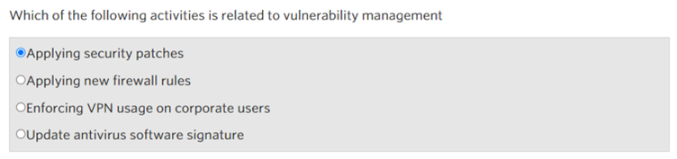

## Cover

<h3 align="center">
    <b>Keamanan Jaringan</b> 
    Cyber Security Professionals
</h3>
 

  

 

    Dosen Pembimbing: 
    Ferry Astika Saputra, S.T., M.Sc.

 

    Disusun Oleh: 
    Bima Aurasakti Rochmatullah (3122640046)

 

    <b>
        KELAS D4 LJ IT B  
        JURUSAN D4 LJ TEKNIK INFORMATIKA  
        DEPARTEMEN TEKNIK INFORMATIKA DAN KOMPUTER   
        POLITEKNIK ELEKTRONIKA NEGERI SURABAYA  
        2023
    </b>

 

## Laporan

Pada modul 4 ini membahas tentang Cyber Security Professionals. Pada modul ini kita akan memahami dimana cyber security dapat diterapkan didalam berbagaimacam role pada sebuah organisasi.

### Network Engineer

Implementing maintaining, supporting and designing communication networks. 

Goal: ensure high availability and provide maximum performance

### Software Developer 

Writing dan coding program. Dalam security perspective: secure coding, code audit

### Security Analysts 

Merencanakan dan mengimplementasikan security measure

### Digital Forensic Analysts 

Meneliti komputer dan electronic storage untuk mendapatkan data yang digunakan sebagai bukti investigasi kriminal

### Security Auditors  

Memastikan rencana security dan control terimplementasi dengan benar

### Penetration Testers 

Melakukan testing pada keseluruhan keamanan dengan mencari jalan untuk mencari kelemahan dari sistem

### Executive Level 

Menjalankan keseluruhan implementasi security

## Screenshot

