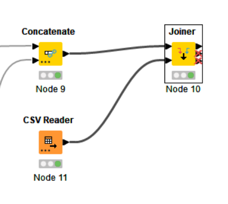
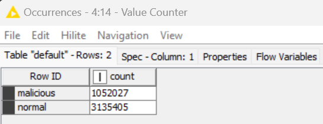
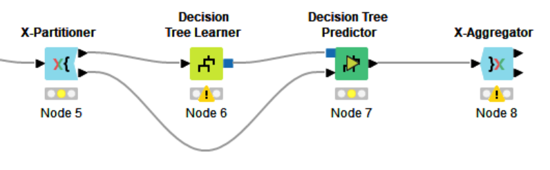
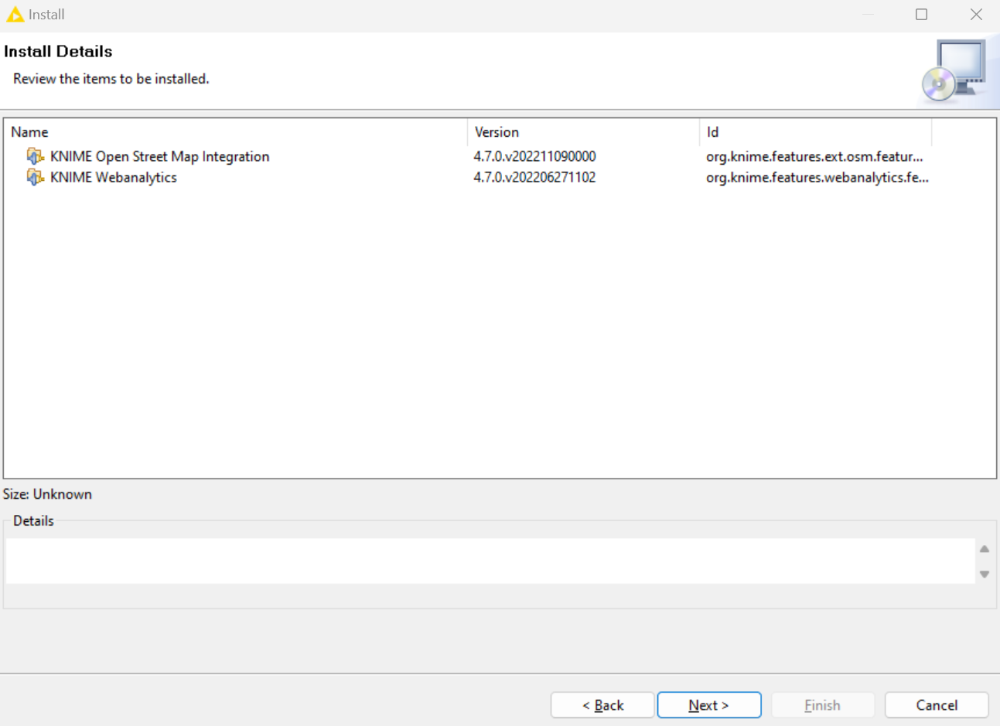
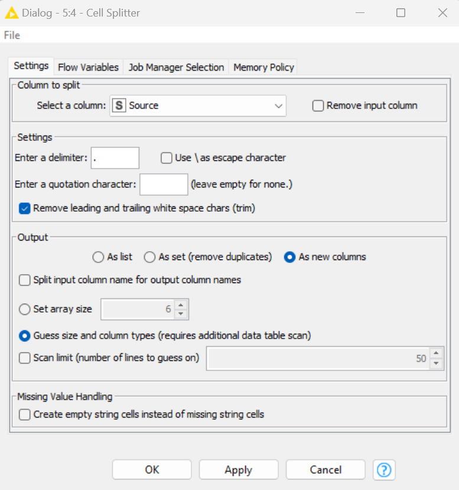

## Cover

<h3 align="center">
    <b>Keamanan Jaringan</b><br>
    Data Mining for Network Security
</h3>
<br>
<p align="center">
  
</p>
<br>
<p align="center">
    Dosen Pembimbing:<br>
    Ferry Astika Saputra, S.T., M.Sc.
</p>
<br>
<p align="center">
    Disusun Oleh:<br>
    Bima Aurasakti Rochmatullah (3122640046)
</p>
<br>
<p align="center">
    <b>
        KELAS D4 LJ IT B <br>
        JURUSAN D4 LJ TEKNIK INFORMATIKA <br>
        DEPARTEMEN TEKNIK INFORMATIKA DAN KOMPUTER <br> 
        POLITEKNIK ELEKTRONIKA NEGERI SURABAYA <br>
        2023
    </b>
</p>
<br>


## Installasi Software

### A. Instalasi Knime Analytics Platform

1. Software ini dapat didownload pada halaman [knime.com](https://www.knime.com/downloads), sesuaikan juga dengan OS pada komputer
2. Untuk instalasi gunakan pengaturan default pada saat proses instalasi
3. Berikut halaman pertama dari software Knime

    

### B. Instalasi Wireshark

1. Software ini dapat didownload pada halaman [wireshark.org](https://www.wireshark.org/). Kemudian sesuaikan 
dengan OS pada komputer.
2. Untuk instalasi nya cukup mudah, ikuti saja alur instalasinya dengan pengaturan default.
3. Berikut capture dari software wireshark yang sudah diinstall.

    

## Wireshark

1. Proses ini digunakan untuk mengamati file Packet Capture (.pcap). File tersebut berisi lalu lintas jaringan yang ditangkap oleh komputer. Pada kasus kali ini akan digunakan dataset traffic DNS ISOT yang berasal dari University of Victoria karena terdapat simulasi serangan Botnet pada traffic DNS. Untuk memperoleh dataset ini dapat mengunjungi link [uvic.ca](https://www.uvic.ca/engineering/ece/isot/datasets/)

2. File tersebut dibagi menjadi 5 yaitu : init.pcap, init2.pcap, init3.pcap, init4.pcap, init5.pcap

    

3. Kemudian buka file tersebutsecara bergantian menggunakan Wireshark. Pada langkah ini kita gunakan file init.pcap

    

4. Untuk mempermudah pada saat proses analisa yang akan dilakukan nantinya, kita akan mengambil data dengan ip versi 4 (ipv4) dan protocol TCP, DNS saja. Untuk proses tersebut dapat dilakukan pada wireshark menggunakan perintah ip.version==4 && tcp || dns pada kolom display filter tepat dibawah toolbar.

    ```
    ip.version==4 && tcp || dns
    ```

    

5. Kemudian kita membutuhkan kolom tambahan yaitu delta time. Untuk mendapatkan delta time dan delta time dan delta time display, klik Edit – Preferences – Column

    

    Kemudain klik pada tanda + untuk menambah kolom baru. Kemudian pada Type, pilih Delta Time. Kemudian lakukan hal yang sama untuk kolom delta time display

    

    Kemudian Klik OK. Berikut hasilnya.

    

6. Langkah terakhir yaitu export file pcap tersebut keformat Comma-separated Value (.csv) dengan cara klik File – Export Packet Dissections – As CSV. Yang perlu diperhatikan yaitu pada Pacet Range, pastikan yang terpilih yaitu Displayed, karena data pada Displayed ini sudah terfilter denga nip version 4.

    

7. Lakukan semua proses diatas pada dataset berikutnya (init2.pcap, init3.pcap, init4.pcap, init5.pcap) hingga seluruh data sudah terkonversi ke dalam format .csv

    

## Knime Analytics Platform

### A. Penggabungan Data

1. Setelah semua file tadi telah diexport menjadi file .csv. Buka software Knime Analytics Platform untuk melakukan proses analisa pada traffic DNS.

2. Setelah software Knime telah terbuka. Terdapat 3 bagian utama dari software ini. Yang pertama yaitu Knime Explorer yang isinya adalah project project yang kita buat pada software ini.

    

    Kemudian terdapat Node Repository, bagian ini merupakan bagian yang sangat penting, karena berisi seluruh fungsi tools dari software ini yang dinamakan dengan Node

    

    Terakhir yaitu Knime Workflow, bagian ini adalah bagian visual pada Knime, seluruh fungsi yang digunakan akan ditampilkan pada bagian ini. Berikut adalah contoh tampilan pada Knime Workflow

    

3. Setelah mengenal semua bagian dari Knime. Setelah itu kita akan membuat workflow/project baru. Dengan cara klik File – New – New Knime Workflow – Tulis Nama workflow dan Lokasi workflow tersebut – Klik Finish

    
    

4. Selanjutnya yaitu menggabungkan seluruh data tadi menjadi 1 data. Node yang dibutuhkan untuk proses ini yaitu : 
    
    a. File Reader : untuk membaca data
    
    b. Concatenate : untuk menggabungkan data

    

    Karena node Concatenate hanya dapat menerima input dari 2 data, maka diperlukan lebih dari 1 node Concatenate. Untuk melihat konfigurasi dari File Reader, dapat digunakan cara klik kanan pada Node, lalu configure

    

    Untuk konfigurasi file reader hanya tinggal memasukkan file csv yang telah diexport pada langkah sebelumya. Klik Aplly – OK. Proses ini belum selesai, karena Node belum di jalankan, untuk menjalankan Node bisa dengan cara klik kanan pada Node – Execute. Bila berhasil dijalankan, status Node yang berada dibawah Node akan berubah berwarna Hijau.

    

### B. Pelabelan Data

1. Selanjutnya yaitu proses melabeli data. Pada data ISOT terdapat 2 tipe data, yaitu malicious dan normal. Pertama kita harus menyediakan tabel dengan label malicious yang sudah ditentukan seperti berikut. 

    

2. Kemudian selanjutnya akan menggabungkan 2 tabel menggunakan node Joiner. Node ini membutuhkan 2 input data. 

    

3. Untuk konfigurasi Joiner, dapat menggunakan konfigurasi berikut

    
    

    Lalu klik OK dan jalankan. Hasilnya akan seperti berikut

    

4. Dari langkah 7 menghasilkan output data dengan label malicious tetapi masih terdapat data dengan berlabel “?”. Hal ini dikarenakan kita hanya labeling untuk data malicious saja. Untuk melakukan labeling data normal kita akan menggunakan Node Missing Value. Node ini digunakan untuk mengisi data kosong. Untuk konfigurasi, dapat menggunakan konfigurasi berikut.

    

    Konfigurasi ini nantinya akan mengisi value yang kosong dengan value Normal. Berikut hasil dari proses Missing Value

    

5. Untuk memastikan bahwa kolom label sudah terisi dengan value Malicious atau Normal, dapat menggunakan node Value Counter. Node ini berfungsi untuk menghitung jumlah seluruh value pada kolom terpilih. Berikut adalah hasil dari perhitungan value dengan Value Counter. Dalam konfigurasinya tinggal memilih kolom yang ingin dihitung yaitu kolom label.

    

    Dari gambar tersebut bisa dilihat jika sudah tidak ada data yang memiliki label kosong, hanya terdapat 2 label yaitu Normal dan malicious

6. Export file ke dalam format .csv dengan menggunakan node CSV Writer

    


## Knime for Data Mining

Pada langkah ini, kita akan melakukan sebuah analisa pada data ISOT dengan menggunakan platform Knime. Pada proses sebelumnya kita sudah melakukan penggabungan data dan pelabelan data. Pada proses ini kita akan melakukan analisa data dengan menggunakan Teknik Data Mining. Data mining adalah proses penggalian data atau penemuan informasi baru dengan mencari pola atau aturan tertentu dari sebuah data. Di dalam Data Mining terdapat beberapa proses yang harus dilakukan terlebih dahulu sebelum dilakukannya data mining. Berikut tahapan-tahapan untuk melakukan data mining, yaitu 
1. Data Pre-Processing
2. Data Transformation
3. Data Mining
4. Evaluation

### A. Data Pre-processing

1. Proses ini adalah proses dimana data akan dibersihkan (cleaning) karena biasanya didalam suatu data terdapat nilai-nilai yang tidak sempurna atau bahkan terdapat nilai-nilai yang hilang atau kosong yang nantinya akan dapat mempengaruhi proses kedepannya. Pada proses ini kita membutuhkan Node-node berikut : File Reader, Column Filter, Missing Value.

    

2. Sebelum memulai data pre-processing, langkah pertama yaitu membaca file data csv yang sudah diexport pada proses sebelumnya menggunakan Node File Reader. Untuk konfigurasinya cari lokasi file data yang diexport tadi.

3. Selanjutnya kita akan menggunakan Node Column Filter. Node ini berfungsi untuk mem-filter kolom atau atribut yang tidak digunakan. Disini kita hanya menggunakan 3 atribut, yaitu : Delta_time, length dan label.

    

4. Setelah langkah 2 dijalankan, data tersebut menjadi memiliki 3 kolom atau atribut yang sebelumnya terdapat 9 kolom. Selanjutnya kita akan menjalankan Node Missing Value. Node ini sudah pernah kita pakai pada proses labeling data. Tetapi pada proses ini kita akan melakukan pembersihan data, karena biasanya didalam suatu data terdapat kolom yang tidak sempurna seperti data yang hilang atau atribut yang tidak relevan, untuk itu Node ini diperlukan untuk mengatasi hal tersebut. Berikut konfigurasinya

    

### B. Data Transformation

1. Setelah melakukan data pre-processing, selanjutnya akan menuju ke proses data transformation, pada proses ini data akan diubah ke format yang sesuai untuk proses data mining. Node yang diguanakn pada tahap ini yaitu Normalizer. Berikut konfigurasinya

    

2. Setelah dijalankan, kolom dari data tersebut akan berubah menjadi bentuk range. Data inilah yang nantinya akan digunakan dalam pengenalan pola. Berikut adalah hasil dari Node Normalizer

    

    Setelah mendapatkan data ini, baru kita dapat menjalankan proses Data Mining

### B. Data Mining

1. Setelah menyelesaikan tahap data transformation, kita akan menjalankan proses Data Mining, dalam proses ini kita akan menggunakan Metode Klasifikasi Decision Tree dengan teknik Cross Validation. Pada proses ini kita membutuhkan Node-node berikut : X-Partitioner, Decision Tree Learner, Decision Tree Predictor, X-Aggregator Sehingga akan membentuk flow seperti ini

    

2. X-Partitioner berfungsi untuk menentukan jumlah iterasi atau pengulangan pada teknik cross validation, data ini nantinya akan terbagi menjadi 2 yaitu data training dan data testing. Berikut konfigurasinya

    

3. Decision Tree Learner berfungsi sebagai data training, karena metode Decision Tree merupakan supervised learning, sehingga membutuhkan data training untuk mengenali pola dari setiap data. Berikut konfigurasi dari Decision Tree Learner

    

4. Setelah menjalankan Decision Tree Learner, lalu dilanjutkan dengan Decision Tree Predictor. Node ini berfungsi untuk menklasifikasi data dengan cara menguji data testing dengan hasil dari proses Decision Tree Learner. Berikut konfigurasinya

    

5. Node X-Aggregator berfungsi sebagai akhir dari proses cross validation. Node ini akan mengumpulkan hasil dari Node Predictor yang akan menampilkan hasil dari prediksi dari beberapa iterasi yang dilakukan. Tidak ada konfigurasi khusus dari node ini, sehingga bisa langsung dijalankan. Berikut adalah hasil dari node X-Aggregator. Dari hasil ini akan mendapatkan kolom baru yaitu kolom prediksi.

    

#### **Evaluation**

1. Proses ini merupakan proses terakhir pada tahap data mining yaitu merupakan hasil dari teknik data mining berupa hasil prediksi untuk menilai apakah model ini dapat digunakan untuk mengenali pola serangan pada data ISOT. Untuk langkah ini kita akan menggunakan Node Scorer yang didalamnya terdapat perhitungan untuk melihat seberapa baik model ini dengan menggunakan teknik confusion matrix. Berikut konfigurasinya.

    

2. Setelah node ini dijalankan, kita dapat melihat presentase dari hasil confusion matrix. Hasil inilah yang nantinya akan digunakan untuk menentukan keputusan apakah model ini baik atau tidak dalam menanagani kasus data ISOT Botnet untuk mendeteksi serangan.

    

## Knime For Visualisation Using Open Street Map

Pada bagian ini, kita akan membuat visualisasi serangan menggunakan Open Street Map. Sebelum memulai, terdapat beberapa ekstensi yang harus kita install terlebih dahulu untuk menjalankan beberapa node, yaitu :
1. KNIME OpenStreetMap extension
2. KNIME Web Analytics extension

Untuk mendapatkan ekstensi ini dapat dilakukan dengan cara klik File – Install Knime Extension




Lalu kita tinggal ketik saja ekstensi yang dibutuhkan, lalu klik Next – klik Next lagi – Pilih Accept terms agreement – Finish. Setelah extension selesai di download dan di install Knime akan melakukan restart. Setelah itu ikut langkah-langkah berikut :

### A. Load File IP Address

1. Pertama kita akan membutuhkan 2 tabel, tabel pertama yaitu file dataset kita, yang kedua yaitu file GeoIP database yang bisa didapatkan di link [dev.maxmind.com](http://dev.maxmind.com/geoip/). 

2. Pada tabel pertama, kita membutuhkan setidaknya 6 Node pada proses ini, yaitu : File Reader, Value Counter, RowID, Cell Spliter, Math Formula dan Column Filter. Output dari proses ini yaitu berupa data dengan kolom : Source, Count dan Source-number. Berikut gambaran workflow yang akan dibuat.

    

3. File Reader merupakan proses untuk membaca data yang ingin diproses. Untuk konfigurasinya hanya mencari file data yang telah tersimpan.

    

4. Jika file sudah berhasil terbaca, langkah selanjutnya yaitu menghitung jumlah IP pada data tersebut, karena kita hanya membutuhkan data IP (Source). Untuk konfigurasinya kita set “Columns with value to count” ke Source lalu jalankan. 

    
    

5. Selanjutnya, karena proses Value Counter tadi merubah kolom RowId menjadi source untuk mengembalikannya kita membutuhkan node RowID dengan konfigurasi.

    
    

6. Kemudian proses selanjutnya yaitu kita akan memecah IP address menjadi 4 bagian karena kita akan mengubah IP address menjadi IP number. Untuk memecah IP address kita membutuhkan node Cell Splitter dengan konfigurasi

    

    Setelah node ini dijalankan, akan menghasilkan 4 tambahan kolom baru sebagai pecahan dari IP address

    

7. Jika IP address sudah terpecah menjadi 4 bagian, selanjutnya kita akan mengubah IP address menjadi IP number dengan menggunakan Node Math Formula dengan konfigurasi

    ```
    ($Source_Arr[0]$  * 16777216) + ($Source_Arr[1]$  * 65536) + ($Source_Arr[2]$  * 256) + $Source_Arr[3]$
    ```

    

    Setelah node ini dijalankan, akan menghasilkan kolom baru yaitu Source-number yang berisi konversi dari IP address ke IP number.
    
    

8. Setelah berhasil merubah IP address menjadi IP number, selanjutnya kita akan menghilangkan kolom-kolom pecahan dari IP, karena kita sudah tidak membutuhkannya, caranya dengan menggunakan node Column Filter, kemudian kita exclude semua kecuali Count, Source dan Source-number 

    
    

8. Setelah berhasil merubah IP address menjadi IP number, selanjutnya kita akan menghilangkan kolom-kolom pecahan dari IP, karena kita sudah tidak membutuhkannya, caranya dengan menggunakan node Column Filter, kemudian kita exclude semua kecuali Count, Source dan Source-number 

    
    

### B. Load GeoIP Database

***Custom Step**

1. Setelah kita mendownload data GeoIP database, kita akan mendapatkan dua tipe data, yaitu GeoLiteCity-Blocks dan GeoLiteCity-Location. Dua file ini kita load dengan 2 node Reader, 2 Sell Splitter, 2 Math Formula, 1 node Joiner, dan 1 Node RowID

    
    
    

    Pada data GeoLiteCity-Blocks kita membutuhkan data startIpNum dan endIpNum. Untuk itu saya melakukan clone repo [berikut](https://github.com/maxmind/geoip2-csv-converter) untuk mendapatkan range IP dari data network yang sudah ada. Kita jalankan Go programnya menggunakan command sebagai berikut untuk menhasilkan data GeoLiteCity-Blocks yang mengandung IP range

    ```
    go run main.go -block-file=GeoLite2-City-Blocks-IPv4.csv -output-file=GeoLite2-City-Blocks-range.csv -include-range 
    ```

    
    

    Setelah berhasil berhasil mendapatkan IP rangenya selanjutnya kita ubah IP tersebut menjadi IP number menggunakan cell splitter dan math formula dengan cara yang sama seperti langkah sebelumnya. Berikut ini adalah hasil data akhirnya

    

2. Selanjutnya kita akan menggabungkan dua file tersebut menjadi satu menggunakan node Joiner. Dari 2 file tersebut kita akan mengambil 5 kolom, yaitu : startIpNum, endIpNum, city, latitude dan longitude. 

    
    

3. Setelah data berhasil di jadikan satu dengan Joiner terdapat perubahan pada kolom rowID menjadi hasil join rowID dari kedua tabel. Untuk mengatasi ini bisa menggunakan node RowID untuk mengembalikan rowID seperti semula

    

### C. Get Location IP 

1. Setelah dua tabel tersebut sudah di load. Langkah selanjutnya yaitu mendapatkan lokasi IP dari dataset kita yaitu ISOT. Pada langkah ini akan dibutuhkan 2 node yaitu : Binner dan Joiner.

    

2. Node Binner ini berfungsi untuk meng-kategorikan data berdasarkan tabel rule/dictionary. Pada kasus ini tabel rule adalah tabel GeoIP database. Peng-kategorian ini berdasarkan IP number atau IP address yang tadi sudah diubah ke format number

    

    Setelah dijalankan, akan menghasilkan data yang telah dikategorikan, kategori ini akan tersimpan pada kolom RowID

    

3. Setelah pengelompokan kategori, kita akan membutuhkan beberapa kolom yang akan digunakan untuk visualisasi, yaitu : count, source, city, latitude dan longitude. Untuk mendapatkannya kita dapat menggunakan node Joiner dengan input dari node Binner dan GeoIP Database file kemudian di Join berdasarkan RowID.

    
    

    Hasil dari proses ini yaitu data sudah mendapatkan latitude, longitude dan city.

    

### D. Map Marker

1. Proses ini digunakan untuk sebagai tanda lokasi terjadinya serangan berdasarkan longitude dan latitude. Pada proses ini dibutuhkan setidaknya 5 node, yaitu : Constant Value Column, Domain Calculator, Size Manager, Shape Manager dan Color Manager.

    

2. Constant Value Column ini digunakan untuk menambahkan/mengganti kolom yang berisi nilai konstan di setiap baris. Pada proses ini kita akan menambahkan kolom bernama shape-helper dengan value allRedCircles di semua baris.

    
    

3. Kemudian selanjutnya node Domain Calculator ini berfungsi untuk memindai data dan memperbarui daftar nilai yang mungkin dan / atau nilai minimum dan maksimum kolom yang dipilih. Node ini yang nantinya akan mempengaruhi data apa saja yang akan di tampilkan pada Peta.

    

4. Selanjutnya yaitu Size Manager, node ini digunakan untuk mengatur ukuran besar tidaknya marker yang ada di peta berdasarkan jumlah dari aktifitas IP tersebut. 

    

5. Kemudian setelah itu terdapat node Shape Manager yang berfungsi untuk menentukan bentuk Marker yang akan ditampilkan di peta.

    

7. Terakhir yaitu terdapat node Color Manager yang berfungsi untuk mengatur warna marker yang akan ditampilkan di peta.

    

### E. Visualisasi Pada Peta

1. Proses terakhir yaitu, mem-visualisasikan dari proses sebelumnya kedalam Peta. Pada proses ini kita akan membutuhkan Node yang bernama OSM Map View. Node ini berfungsi untuk menampikan data pada peta. Node ini membuthkan coordinate yang didapatkan dari Latitude Longitude, serta dapat juga menampilkan info dari marker yang terlihat di peta

    
